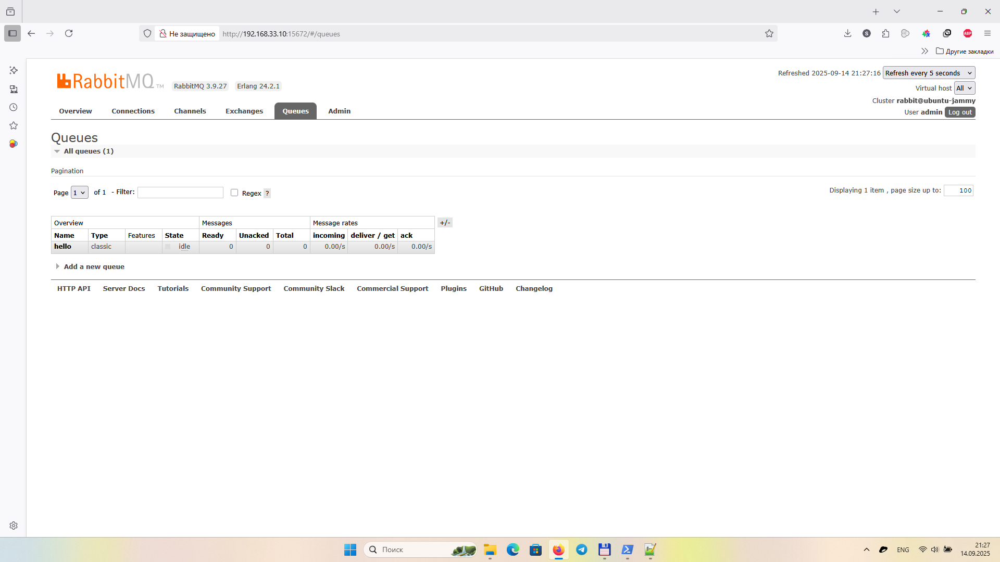

# RabbitMQ
## Задание 1. Установка RabbitMQ

Используя Vagrant или VirtualBox, создайте виртуальную машину и установите RabbitMQ. Добавьте management plug-in и зайдите в веб-интерфейс.

## Задание 2. Отправка и получение сообщений

## Задание 3. Подготовка HA кластера

